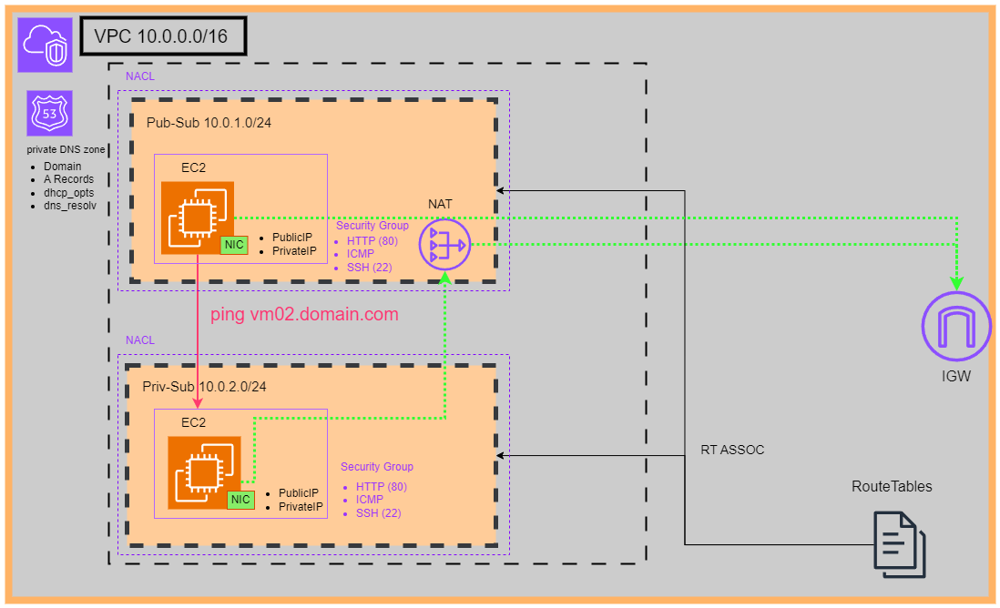

# AWS Infrastruture-as-Code (IaC)



This infrastructure stack sets up an basic environment on the AWS cloud.  
It creates an VM in a public subnet (e.g. an Webserver) and an EC2 in an private subnet (e.g. Database).  
The DNS configuration lets you communicate with the DNS names between the instances.  
Also SSH keys and security groups are created.  
The route tables configure the traffic flow.  

## Components
- VPC, private and public subnets
- NAT gateway
- Elastic IP
- Route Tables + Associations
- Route 53 DNS private hosted zone
- Internet Gateway (IGW)
- EC2 instances
- Security Groups

## Needed tools
AWSCLI, Terraform.  
I used WSL2 for installing them.

### Setup Environment
Install the official AWS CLI.  
```
curl "https://awscli.amazonaws.com/awscli-exe-linux-x86_64.zip" -o "awscliv2.zip"
unzip awscliv2.zip
sudo ./aws/install
```
Run configuration of your Environment
```aws configure``` and paste in your **ACCESS_KEY** and **SECRET_ACCESS_KEY**.  
Also make sure to configure the region.  

## Run
Configure the remote backend 
```
cd infra/remote-state
terraform init && terraform apply -auto-approve
```
OR  
run locally if state is no concern for you.  

***Set the variables in ```variables.tf``` as needed***.

Build the infra:
```
cd infra
terraform init && terraform apply -auto-approve
``` 

## Notes
For managing the state of the remote backend a fitting process needs to be defined.  
This is a very basic example which shows a quick usage of Terraform for demo purposes.